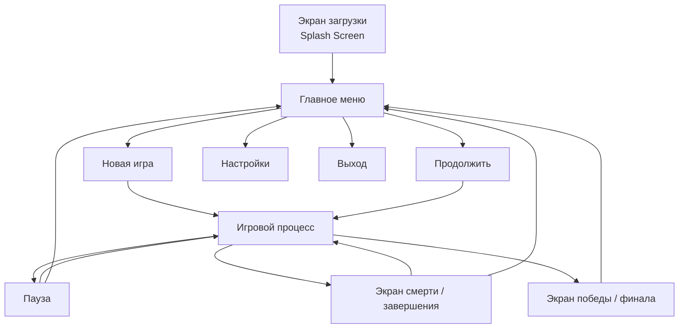

# Задание 3. Интерфейс и UX-сценарии взаимодействия

> Внимание! Данное задание выполняется на основе **вашего** игрового проекта.
 

---

## Цель задания

Спроектировать полную архитектуру пользовательского интерфейса игры и детализировать сценарии взаимодействия игрока с системой.

> Хороший интерфейс — невидимый. Игрок не думает о кнопках, он думает об игре. Ваша задача — спроектировать интерфейс так, чтобы он не мешал, а помогал: понятные кнопки, предсказуемые переходы, чёткая обратная связь на каждое действие.

---

## 3.1. Архитектура экранов  

Перечислите все экраны вашей игры. Для каждого укажите назначение и навигационные связи.

| Экран | Назначение | Откуда попадают | Куда ведёт | Компоненты Unity |
|-------|-----------|:---------------:|:----------:|:----------------:|
| Экран загрузки (Splash) | Запуск, загрузка ресурсов | Запуск игры | Главное меню | SceneManager, LoadingBar |
| Главное меню | Точка входа: новая игра, продолжение, настройки, выход | Экран загрузки | Новая игра / Продолжить → Геймплей; Настройки → Экран настроек | Canvas, Button, MainMenuController |
| Выбор персонажа / уровня | Отображение сохранённых слотов, краткая статистика прогресса | Главное меню (кнопка «Продолжить») | Игровой процесс (загрузка выбранного слота) | SaveSystem, SlotUI, SceneManager |
| Игровой процесс (геймплей) | Основная сцена: движение, бой, сбор рун, диалоги | Главное меню / Экран смерти | Пауза / Диалог / Инвентарь / Экран смерти / Экран победы | PlayerController, HUDManager, SceneManager |
| Меню паузы | Временная остановка: продолжить, настройки, выйти в меню | Геймплей (Escape / Start) | Геймплей (продолжить) / Настройки / Главное меню | PauseMenu, Time.timeScale = 0 |
| Настройки | Регулировка звука, разрешения, управления | Главное меню или Пауза | Обратно в вызвавший экран | SettingsManager, PlayerPrefs, Slider, Toggle |
| Диалог / взаимодействие с NPC | Диалоговое окно с Мерлином или другим NPC; подсказки и квесты | Геймплей (вход в зону триггера NPC) | Геймплей (закрытие диалога) | DialogueManager, TriggerZone, TextMeshPro |
| Инвентарь / карта / журнал | Просмотр собранных рун Экскалибура, карты локации, записей | Геймплей (клавиша I / Tab) | Геймплей (закрытие панели) | InventoryUI, MapRenderer, JournalController |
| Экран завершения уровня / смерти | Сообщение о гибели, статистика попытки, кнопки повтора/меню | Геймплей (HP = 0) | Геймплей (повторить) / Главное меню | DeathScreen, SceneManager, StatTracker |
| Экран финала / победы | Финальная заставка: возвращение Экскалибура, титры, результат | Геймплей (победа над Морганой) | Главное меню | WinScreen, Animator, Credits |

### Схема навигации между экранами

///caption
Рисунок 1 – Схема навигации между экранами (адаптируйте под свою игру)
///

> **Важно.** Схема выше является шаблонной. Замените её схемой, отражающей реальную навигацию вашей игры, включая нестандартные переходы (например: смерть во время диалога, возврат из инвентаря и т.п.).

**Описание логики навигации** (нестандартные ситуации):

Если игрок погибает во время диалога с Мерлином, диалог принудительно закрывается и немедленно активируется экран смерти (DialogueManager вызывает событие `OnPlayerDeath`, обработчик `DeathScreen` открывается поверх). Из меню паузы можно перейти в Настройки — при возврате игра возобновляется автоматически без дополнительного нажатия «Продолжить». Инвентарь недоступен во время диалога и во время катсцены: кнопка I блокируется флагом `inputLocked`. Смерть во время загрузки новой сцены (переход между локациями) откатывает загрузку и возвращает на экран смерти предыдущей сцены через `SceneManager.LoadScene` с сохранённым checkpoint.

---

## 3.2. UX-принципы вашей игры  

UX-принципы — правила, которым вы следуете при проектировании каждого экрана. Они обеспечивают единство опыта во всей игре.

| UX-принцип | Что означает | Как реализован в вашей игре |
|------------|-------------|----------------------------|
| **Минимизация когнитивной нагрузки** | Не заставляйте игрока запоминать — выводите нужную информацию на экран | HUD показывает HP-сердца и счётчик рун Экскалибура постоянно. Подсказка «E — взаимодействие» появляется автоматически при приближении к NPC или объекту — игроку не нужно помнить кнопку |
| **Чёткая визуальная иерархия** | Самое важное — крупнее и контрастнее; второстепенное — мельче и тише | HP-сердца — крупные, верхний левый угол, цвет #FF3333. Счётчик рун — меньше, правый верхний. Stamina-бар — тонкая полоска в нижнем центре, полупрозрачная в покое и яркая при использовании |
| **Своевременная обратная связь** | На каждое действие — немедленная и однозначная реакция | Удар мечом: вспышка частиц + звук за 1 кадр. Сбор руны: анимация «всасывания» + звон + счётчик +1 за 0.1 с. Получение урона: экран мигает красным (Vignette Bloom) + сердце пропадает |
| **Предсказуемость поведения** | Одинаково выглядящие элементы работают одинаково во всей игре | Все интерактивные объекты подсвечиваются зелёным (#50C878) при приближении — руны, NPC, точки сохранения. Игрок видит один паттерн и применяет его везде |
| **Консистентность стиля** | Единый шрифт, палитра, размеры элементов на всех экранах | Шрифт MedievalSharp для заголовков, Cinzel для текста — на всех экранах. Золотые рамки (#D4AF37) — на всех UI-панелях. Кнопки одного размера 200×50 px на главном меню и паузе |
| **Минимальное количество кликов** | Частые действия доступны за 1–2 нажатия | Пауза — Escape (1 нажатие). Продолжить из паузы — Enter (1 нажатие). Инвентарь — Tab (1 нажатие). Повторить уровень после смерти — R (1 нажатие) |
| **Чёткое разделение состояний** | Игрок всегда понимает, в каком состоянии находится объект | Руна: ненайдена — серый силуэт; найдена — золотая иконка с блеском; активирована — синее свечение. Кнопки меню: normal — золотая рамка; hover — рамка ярче, scale ×1.05; disabled — серая рамка, 50% прозрачность |

---

## 3.3. UX-сценарии взаимодействия  

**UX-сценарий (User Flow)** — пошаговое описание того, что происходит в системе, когда игрок выполняет определённое действие.

### Как правильно описать сценарий

- Каждый шаг: **действие игрока → реакция системы → изменение состояния**.
- Обязательно укажите **альтернативный путь** (ошибка, отмена, повтор).
- Укажите **компоненты Unity**, отвечающие за каждый шаг.

---

### Сценарий 1 (обязательный): Запуск игры и начало новой партии

| № | Действие игрока | Реакция системы | Изменение состояния | Компонент Unity |
|:---:|----------------|-----------------|:-------------------:|:---------------:|
| 1 | Запускает приложение | Отображается экран загрузки: логотип, прогресс-бар | LOADING | SceneManager, LoadingBar |
| 2 | Ожидает загрузки | Загружаются ресурсы главного меню, fade-in | READY | AsyncOperation, Animator |
| 3 | Нажимает «Новая игра» | Появляется экран выбора слота сохранения (3 слота); незанятые слоты помечены «Пусто» | SLOT_SELECT | MainMenuController, SaveSystem, SlotUI |
| 4 | Выбирает пустой слот | Слот подсвечивается золотым, появляется кнопка «Начать приключение» | SLOT_CHOSEN | SlotUI, Button |
| 5 | Нажимает «Начать приключение» | Запускается AsyncOperation загрузки сцены «Руины Камелота»; появляется экран fade-to-black с логотипом | LOADING_GAME | SceneManager.LoadSceneAsync, Animator |
| 6 | Игра начинается | Появляется заставка: силуэт Камелота, первые строки нарратива Мерлина; управление передаётся игроку | IN_GAME | CutsceneManager, DialogueManager, PlayerController |

**Альтернатива:** Игрок нажимает «Отмена» → возврат в главное меню.

---

### Сценарий 2 (обязательный): Взаимодействие с ключевым игровым объектом

Опишите сценарий с самым важным интерактивным объектом вашей игры (NPC-диалог, сундук, механизм, загадка и т.п.).

**Объект и его роль:** Мерлин — NPC-наставник; даёт квесты, подсказки и открывает способности Артура при сборе рун

| № | Действие игрока | Реакция системы | Изменение состояния | Компонент Unity |
|:---:|----------------|-----------------|:-------------------:|:---------------:|
| 1 | Подходит к Мерлину | Над NPC появляется иконка «!» (зелёная), подсказка «E — говорить» | IDLE → NEAR_NPC | TriggerZone (OnTriggerEnter2D), DialoguePromptUI |
| 2 | Нажимает E | Геймплей приостанавливается (inputLocked = true); появляется диалоговое окно с портретом Мерлина и первой репликой | DIALOGUE_OPEN | DialogueManager, TextMeshPro, Animator (portrait) |
| 3 | Нажимает E / Space (продолжить) | Следующая реплика появляется посимвольно (typewriter-эффект) | DIALOGUE_NEXT | DialogueManager.ShowNextLine(), Coroutine |
| 4 | Достигает реплики с выбором | Появляются 2–3 варианта ответа, подсвечен первый | DIALOGUE_CHOICE | ChoiceUI, Button, EventSystem |
| 5 | Выбирает вариант ответа | Ветка диалога продолжается; если выбрана нужная руна — открывается способность (всплывающий тост «Новая способность: Щит Камелота!») | ABILITY_UNLOCKED | DialogueManager, AbilitySystem, ToastNotification |
| 6 | Завершает диалог (последняя реплика) | Окно закрывается, inputLocked = false; иконка «!» над Мерлином меняется на «✓» (серая) — диалог просмотрен | IDLE | DialogueManager.CloseDialogue(), TriggerZone |

**Альтернатива (ошибка / невозможность действия):** Если игрок нажимает Escape во время диалога — диалог прерывается, inputLocked = false, прогресс ветки сохраняется (запомнен индекс последней реплики); следующий разговор возобновится с того же места.

---

### Сценарий 3 (по выбору): Дополнительное взаимодействие

Выберите ещё один важный сценарий (инвентарь, покупка, завершение уровня, смерть и респаун и т.п.).

**Название сценария:** Сбор осколка Экскалибура и разблокировка новой способности

| № | Действие игрока | Реакция системы | Изменение состояния | Компонент Unity |
|:---:|----------------|-----------------|:-------------------:|:---------------:|
| 1 | Подходит к светящемуся осколку на полу | Осколок начинает вращаться быстрее, усиливается Point Light (золотое свечение), всплывает подсказка «E — подобрать» | NEAR_SHARD | TriggerZone, Point Light 2D, ShardPromptUI |
| 2 | Нажимает E | Анимация «всасывания»: осколок летит к Артуру, вспышка частиц, звон; объект осколка деактивируется | COLLECTING | ShardPickup.Collect(), ParticleSystem, AudioSource |
| 3 | Осколок подобран | Счётчик рун в HUD обновляется: X/5 → (X+1)/5 с анимацией +1 поверх иконки | SHARD_ADDED | HUDManager.UpdateShardCount(), Animator |
| 4 | (Автоматически) Проверка условия способности | Если собрано нужное количество рун (например, 3/5) — появляется полноэкранная вспышка + тост «Новая способность разблокирована: Удар молнии!» | ABILITY_UNLOCKED | AbilitySystem.CheckUnlock(), ToastNotification, Animator |
| 5 | Нажимает F (посмотреть способность) | Открывается мини-панель способности: иконка, описание, кнопка управления; пауза не активируется, геймплей продолжается | ABILITY_PANEL_OPEN | AbilityPanelUI, InputManager |

**Альтернатива:** Если осколок уже был собран ранее (флаг `collected = true`), объект не активен на сцене — игрок просто проходит мимо без триггера. Если инвентарь заполнен (нештатная ситуация) — всплывает предупреждение «Инвентарь полон», осколок остаётся на месте, не исчезает.

 