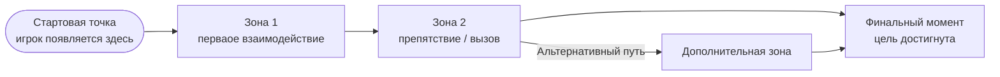

# Задание 4. Вертикальный срез игрового проекта

> Внимание! Данное задание выполняется на основе **вашего** игрового проекта.
 

---

## Цель задания

Задокументировать демонстрационную сцену игры: что реализовано, как работает и что будет показано на защите дипломного проекта.

> **Что такое вертикальный срез**
>
> Вертикальный срез (Vertical Slice) — это работающий игровой фрагмент, который демонстрирует **все** ключевые аспекты игры: геймплей, визуал, звук, интерфейс. Это не технический прототип, а «игра в миниатюре» — именно по ней комиссия оценивает реализуемость вашего концепта.
>
> В вертикальном срезе должно быть: хотя бы 1–2 реализованные механики, визуальное окружение, работающий HUD и хотя бы один интерактивный объект.

---

## 4.1. Структура и задачи вертикального среза (раздел 2.5.1)

| Вопрос | Ваш ответ |
|--------|-----------|
| Что демонстрирует ваш вертикальный срез? | ☑ Ключевую механику ☑ Атмосферу ☑ Нарратив / диалог ☑ Боёвку ☑ Исследование ☐ Другое: |
| Масштаб сцены | ☐ Одна комната ☑ Несколько комнат (кол-во: 3) ☐ Один уровень ☐ Другое: |
| Стартовая точка игрока | Главный зал Руин Камелота — Артур появляется у подножия разрушенного трона |
| Интерактивная зона (главный интерактивный момент) | Диалог с Мерлином в центральном зале + бой с рыцарем-проклятым у выхода |
| Финальная точка / конец среза | Тронный зал: Артур подбирает первый осколок Экскалибура, появляется cutscene-вставка |
| Цель игрока в срезе | Найти и подобрать первый осколок Экскалибура, победив охраняющего его рыцаря-проклятого |
| Примерное время прохождения | 5–8 минут (без гибелей); до 15 минут с изучением окружения |
| Что намеренно отсутствует в срезе | Вторая и третья локации (Заколдованный лес, Цитадель), прокачка (дерево способностей), финальный босс Моргана, система сохранения между сессиями |

### Описание зон сцены

| Зона / точка | Описание | Ключевые объекты | Что происходит |
|:------------:|---------|-----------------|---------------|
| 1. Стартовая точка | Главный зал Руин Камелота: разрушенный тронный зал, полутьма, тлеющие факелы | Разрушенный трон, 2 факела (Point Light 2D), Мерлин (NPC) | Диалог с Мерлином — получение квеста «Найти первый осколок» |
| 2. Первый интерактивный момент | Боковой коридор: узкий проход с платформами, руины стен | Платформы (Tilemap), шипы (Hazard Collider), зелёные руны-подсказки | Платформинг-секция: прыжки через ямы, уклонение от шипов; находится осколок-приманка (ловушка) |
| 3. Препятствие / вызов | Охраняемый зал: рыцарь-проклятый (мини-босс) стережёт настоящий осколок | Рыцарь-проклятый (EnemyController), HealthBar, ArenaBlocker (активируется при входе) | Бой: рыцарь имеет 3 фазы атаки; нужно отбить щитом 2 удара, затем контратаковать; Артур может погибнуть и возродиться у чекпоинта в зале Мерлина |
| 4. Финальный момент | Тронный зал: пьедестал с осколком Экскалибура в центре | ShardPickup (GameObject), Point Light 2D (золотой), CutsceneManager | Артур подбирает осколок → cutscene: вспышка света, голос Мерлина, счётчик 1/5 в HUD → конец среза |

### Схема сцены

///caption
Рисунок 1 – Схема вертикального среза (адаптируйте под свою сцену)
///

---

## 4.2. Реализованные механики (раздел 2.5.2)

Заполните таблицу для каждой реализованной или планируемой механики.

| Механика | Описание работы | Компоненты Unity | Скрипты (классы) | Статус |
|----------|----------------|:----------------:|:----------------:|:------:|
| Перемещение персонажа | Горизонтальное движение влево/вправо, ускорение и торможение через Rigidbody2D.velocity | Rigidbody2D, CapsuleCollider2D | PlayerMovement | ☑ Готово ☐ В работе |
| Прыжок / двойной прыжок | Первый прыжок — пространство; второй — повторное нажатие в воздухе (cooldown 0.1 с) | Rigidbody2D, GroundCheck (Raycast) | PlayerMovement.Jump() | ☐ Готово ☑ В работе |
| Взаимодействие с объектами (кнопка E) | При входе в триггер объекта появляется подсказка; E запускает соответствующий обработчик | Collider2D (Is Trigger), OnTriggerEnter2D | InteractionHandler, IInteractable | ☑ Готово ☐ В работе |
| Диалоговая система | Посимвольный вывод реплик (typewriter), переключение по E/Space, поддержка ветвления | TextMeshPro, Canvas, EventSystem | DialogueManager, DialogueData (ScriptableObject) | ☑ Готово ☐ В работе |
| Подбор предметов | Контакт с ShardPickup → Collect(): деактивация объекта, +1 к счётчику, анимация и звук | Collider2D (Is Trigger), Inventory | ShardPickup, InventorySystem | ☑ Готово ☐ В работе |
| Боевая система / атака | Лёгкая атака (ЛКМ) и тяжёлая (Ctrl+ЛКМ); AttackCollider активируется на 3 кадра; хит-стоп 0.05 с | Animator, BoxCollider2D (AttackZone) | PlayerCombat, EnemyHealth.TakeDamage() | ☐ Готово ☑ В работе |
| Триггеры событий | ArenaBlocker: закрывает выход при входе в зону боя и открывает после победы | Collider2D (Is Trigger) | ArenaTrigger, EventManager | ☑ Готово ☐ В работе |
| HUD / отображение статов | 5 сердец HP, stamina-бар, счётчик осколков [X/5] — обновляются через Unity Events | Canvas (Screen Space Overlay), TextMeshPro, Image | HUDManager, PlayerStats | ☑ Готово ☐ В работе |
| Система сохранения / чекпоинт | Чекпоинт при касании зелёной руны-точки сохранения; данные в PlayerPrefs (позиция, HP, собранные осколки) | Collider2D (Is Trigger), PlayerPrefs | CheckpointSystem, SaveData | ☐ Готово ☑ В работе |
| Другое: Система освещения (URP 2D) | Global Light 2D (синий, intensity 0.15) + Point Light 2D на факелах и рунах; Bloom через URP Volume | Light2D, Global Light 2D, URP Volume | — (настройка без скриптов) | ☑ Готово ☐ В работе |

### Описание ключевой механики (подробно)

Выберите одну самую важную механику и опишите её логику детально.

**Название механики:** Боевая система (атака мечом + блок щитом)

| Событие / триггер | Что происходит в системе | Изменение состояния игры |
|-------------------|------------------------|--------------------------|
| Игрок нажимает ЛКМ (лёгкая атака) | `PlayerCombat.LightAttack()` вызывает `Animator.SetTrigger("AttackLight")`; BoxCollider2D (AttackZone) активируется на кадрах 3–6 анимации | Состояние аниматора: IDLE → ATTACK_LIGHT → IDLE |
| Проверка условий (коллизия, инвентарь и т.п.) | `OnTriggerEnter2D` AttackZone: проверяется тег врага (`Enemy`), не находится ли Артур в состоянии Hurt/Death | Если враг в зоне и Артур не получает урон — попадание засчитывается |
| Выполнение действия (успех) | `EnemyHealth.TakeDamage(damage)` вычитает HP; хит-стоп: `Time.timeScale = 0` на 0.05 с; частицы крови/искр из `HitParticles` | HP врага уменьшается; если 0 → вызывается `EnemyHealth.Die()` → анимация смерти → деактивация через 1 с |
| Невозможность выполнить (неудача) | Враг заблокировал (AnimatorState = BLOCK): `TakeDamage` возвращает 0 урона; звук отбивания щита | Урон не нанесён; Артур на 0.3 с получает статус отдачи (pushback) |
| Визуальная / звуковая обратная связь | Спрайт врага мигает белым (материал `HitFlash`, coroutine 0.1 с); воспроизводится `SFX_SwordHit`; пыль от удара | Игрок видит и слышит попадание за <1 кадр после касания |
| Сохранение результата / изменение данных | Если враг уничтожен: `EnemyManager.OnEnemyDeath()` → обновление списка врагов в сцене; `ArenaTrigger` проверяет остаток врагов | Если все враги в арене мертвы → `ArenaTrigger.OpenExit()` → ArenaBlocker деактивируется |

---

## 4.3. Используемые ассеты и инструменты (раздел 2.5.3)

> **Важно!** Убедитесь, что все ассеты имеют лицензию, разрешающую использование в **учебных и некоммерческих** проектах. Обязательно указывайте автора и ссылку в разделе «Список источников» ВКР.
>
> Бесплатные источники: Unity Asset Store (free), itch.io, OpenGameArt.org, Kenney.nl, freesound.org.

| Категория | Название / источник | Лицензия | Платный / бесплатный | Как используется в сцене |
|-----------|-------------------|---------|:-------------------:|-------------------------|
| Персонаж (спрайт / модель) | Hero Knight (Aarav Shah) / Unity Asset Store | Asset Store EULA | Бесплатный | Спрайты Артура: idle, walk, run, attack, hurt, death |
| Анимации персонажа | Hero Knight (включены в пакет) | Asset Store EULA | Бесплатный | Animator Controller с FSM: все состояния персонажа |
| Тайлсет / окружение | Dungeon Tileset II (0x72) / itch.io | CC0 | Бесплатный | Стены, пол, платформы, колонны сцены Руин Камелота |
| Фоновое изображение | Ручная отрисовка (собственный ассет) | Авторские права студента | — | Многослойный параллакс-фон: небо, руины, туман (4 слоя) |
| UI-элементы (кнопки, панели) | Fantasy UI (Kenney.nl) | CC0 | Бесплатный | Рамки панелей, иконки HP-сердец, кнопки меню |
| Шрифты | MedievalSharp (Wojciech Kalinowski) / Google Fonts | OFL 1.1 | Бесплатный | Заголовки меню и диалоговых окон |
| Фоновая музыка | «Dark Fantasy» Kevin MacLeod / incompetech.com | CC BY 4.0 | Бесплатный | Фоновая музыка игровой сцены (loop) |
| Звуковые эффекты (SFX) | freesound.org (лицензии CC0 / CC BY) | CC0 / CC BY | Бесплатный | Удары меча, подбор руны, шаги, смерть врага |
| Unity-пакеты из Asset Store | 2D Lights & Shadows (Free) / Asset Store | Asset Store EULA | Бесплатный | Дополнительные эффекты свечения для рун |
| Собственные ассеты | Осколки Экскалибура, руны, Мерлин (спрайты) | Авторские права студента | — | Ключевые игровые объекты, нарисованные для проекта |

---
 