# Соотношение с ВКР

> Данный раздел показывает, какие материалы практической работы и в каком именно разделе дипломного проекта (ВКР) должны быть использованы.

---

## Общая схема использования материалов

```mermaid
flowchart TD
    T1[Задание 1\nВизуальная концепция] --> VKR1[ВКР: 1.3.2\nОбоснование художественной стилистики]
    T1 --> VKR2[ВКР: 2.2.6\nВизуальная концепция]

    T2[Задание 2\nТЗ для художника] --> VKR3[ВКР: 2.3.1\nТЗ на персонажа]
    T2 --> VKR4[ВКР: 2.3.2\nТЗ на локацию]
    T2 --> VKR5[ВКР: 2.3.3\nТЗ на интерфейс]
    T2 --> VKR6[ВКР: 2.3.4\nТЗ на ассеты]

    T3[Задание 3\nИнтерфейс и UX] --> VKR7[ВКР: 2.4.1\nАрхитектура экранов]
    T3 --> VKR8[ВКР: 2.4.2\nUX-принципы]
    T3 --> VKR9[ВКР: 2.4.3\nUX-сценарии]

    T4[Задание 4\nВертикальный срез] --> VKR10[ВКР: 2.5.1\nСтруктура среза]
    T4 --> VKR11[ВКР: 2.5.2\nМеханики и компоненты]
    T4 --> VKR12[ВКР: 2.5.3\nИспользованные ассеты]
    T4 --> VKR13[ВКР: 2.5.4\nТребования к демонстрации]

    T5[Задание 5\nАйдентика] --> VKR14[ВКР: 3.1.3\nКонкурентное позиционирование]
    T5 --> VKR15[ВКР: 3.3.3\nПродвижение и позиционирование]
```

///caption
Рисунок 1 – Соответствие заданий практики разделам ВКР
///

---

## Детальная таблица соответствия

| Задание практики | Раздел ВКР | Что именно переносится | Примечание |
|-----------------|-----------|----------------------|-----------|
| **Задание 1.1** — Описание художественного стиля (5 аспектов) | **1.3.2** Обоснование художественной стилистики | Текст всех 5 аспектов; таблица технической реализации в Unity | Переносится целиком |
| **Задание 1.1** — Описание художественного стиля | **2.2.6** Визуальная концепция | Итоговое описание концепции (4–6 абз.) | Может быть доработано |
| **Задание 1.2** — Цветовая палитра | **2.2.6** Визуальная концепция | Таблица палитры со всеми HEX-кодами | Добавить скриншот палитры |
| **Задание 1.3** — Мудборд и референсы | **1.3.2** / **2.2.6** | Таблица референсов + итоговое описание | Изображения — в Приложение |
| **Задание 2.1** — ТЗ на главного персонажа + промпт | **2.3.1** ТЗ на персонажа | Один пример в основной текст; остальные персонажи — в Приложение | Обязательно включить промпт |
| **Задание 2.2** — ТЗ на ключевую локацию + промпт | **2.3.2** ТЗ на локацию | Один пример в основной текст; остальные локации — в Приложение | |
| **Задание 2.3** — ТЗ на HUD и главное меню | **2.3.3** ТЗ на интерфейс | Оба ТЗ в основной текст | |
| **Задание 2.4** — ТЗ на ключевой ассет | **2.3.4** ТЗ на ассеты | Один пример в текст; полный список — в Приложение | |
| **Задание 3.1** — Архитектура экранов | **2.4.1** Архитектура экранов | Таблица + схема навигации | Схему можно нарисовать в Miro / draw.io |
| **Задание 3.2** — UX-принципы | **2.4.2** UX-принципы | Таблица принципов с примерами реализации | |
| **Задание 3.3** — UX-сценарии (3 сценария) | **2.4.3** UX-сценарии | Все 3 сценария; таблицы шагов с компонентами Unity | Диаграммы можно добавить из Figma |
| **Задание 4.1** — Структура и задачи среза | **2.5.1** Структура вертикального среза | Таблица вопросов + описание зон | |
| **Задание 4.2** — Реализованные механики | **2.5.2** Реализованные механики | Таблица механик + подробное описание ключевой | |
| **Задание 4.3** — Ассеты и инструменты | **2.5.3** Использованные ассеты | Полная таблица ассетов с лицензиями | Все лицензии должны быть проверены |
| **Задание 4.4** — Чеклист готовности | **2.5.4** Требования к демонстрации | Чеклист + план демонстрации | Чеклист актуализировать перед защитой |
| **Задание 5.1–5.2** — Айдентика + позиционирование | **3.3.3** Продвижение и позиционирование | Полный блок айдентики и ключевого сообщения | |
| **Задание 5.3** — Конкурентный анализ | **3.1.3** Конкурентное позиционирование | Таблица сравнения с аналогами + вывод | |
| **Задание 5.4** — Каналы продвижения | **3.3.3** Продвижение и позиционирование | Таблица каналов с конкретными действиями | |

---

## Что идёт в основной текст, что в Приложение

> В дипломном проекте действует правило: **в основном тексте — по одному демонстрационному примеру каждого вида**. Остальные материалы — в Приложение с перекрёстными ссылками.

| В основной текст (Главы 2–3) | В Приложение |
|------------------------------|-------------|
| Один пример ТЗ на персонажа (главный герой) | ТЗ на всех остальных персонажей |
| Один пример ТЗ на локацию (стартовая зона) | ТЗ на все остальные локации |
| ТЗ на HUD + ТЗ на главное меню | ТЗ на остальные экраны |
| Один пример ТЗ на ассет (ключевой предмет) | Полный список ассетов |
| Итоговое описание визуальной концепции | Мудборд с изображениями |
| Все UX-сценарии (3 штуки) — таблицами | Wireframes / макеты из Figma |
| Чеклист готовности вертикального среза | Видеозапись геймплея |

---

## Важные замечания

> **Лицензии ассетов.** Все использованные ассеты должны иметь лицензию, разрешающую использование в учебных и некоммерческих проектах. Обязательно указывайте автора и ссылку в разделе «Список источников» ВКР.

> **Промпты для нейросетей.** Если используете нейросетевую генерацию, укажите: инструмент, промпт, дату генерации. Сгенерированные изображения размещаются в Приложении с указанием источника.

> **Схемы и диаграммы.** Архитектуру экранов и UX-сценарии рекомендуется дополнительно нарисовать в Figma, Miro или draw.io и приложить скриншоты к соответствующим разделам ВКР.

